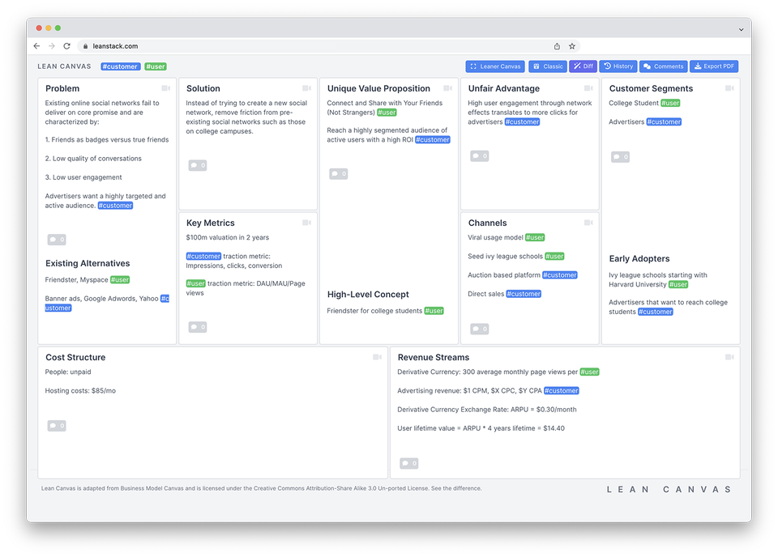

# Internal innovation

We often have great ideas for how to improve the way we work at SixPivot, this could be a process improvement, or a project template, or even a full-scale product idea. To enable us to capture, prioritise, and execute on these ideas we have an ideas register located [here](https://sixpivot.sharepoint.com/sites/allstaff/Lists/Ideas%20Register/AllItems.aspx).

### Process for Ideas & Initiatives

1. Add ideas to the [Ideas Register](https://sixpivot.sharepoint.com/sites/allstaff/Lists/Ideas%20Register/AllItems.aspx)
2. Ideas will be reviewed and prioritised by leadership team
   1. Currently selected ideas will complete a "lean canvas" or "pitch on a page"
   2. An idea "champion" will be assigned to help make sure that the idea keeps momentum
3. Idea progress will be tracked in the [Ideas Register](https://sixpivot.sharepoint.com/sites/allstaff/Lists/Ideas%20Register/AllItems.aspx)
   1. Execution of the ideas can be managed in whichever way makes more sense
4. Sixers will have a short segment to review progress on active initiatives

### Defining Ideas

As ideas proceed through the process, we will need to defined the initiative in more detail, taking into consideration the benefits, risks, and commercial impacts of adopting the idea.

A **Lean Canvas** is a 1-page business plan template created by Ash Maurya that helps you deconstruct your idea into its key assumptions. It replaces elaborate business plans with a single page business model.

### Executing Ideas

[**Design Sprints**](https://www.interaction-design.org/literature/topics/design-sprints) are an intense 5-day process where user-centered teams tackle design problems. Working with expert insights, teams ideate, prototype and test solutions on selected users. Google’s design sprint is the framework to map out challenges, explore solutions, pick the best ones, create a prototype and test it.

.png>)
